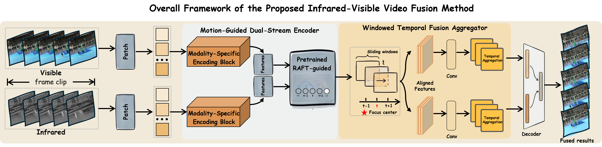

# AURA: A Low-Altitude Infrared-Visible Video Dataset and Benchmark for Smart-City Perception

## 🖼️ Overall Framework

  

---

## 🌍 Scene Coverage

  

## 🎬 Video Demos

These demo videos are **not generated by any fusion algorithm**.  
They are created by simply overlaying the registered infrared and visible frames and exporting them as videos for visualization purposes.

### Demo 1

https://github.com/user-attachments/assets/79e1dfef-b6e9-4ec8-86d1-fbd55783948a

### Demo 3

https://github.com/user-attachments/assets/4817d2c8-c885-4328-8ce6-bf1445f1cb84

